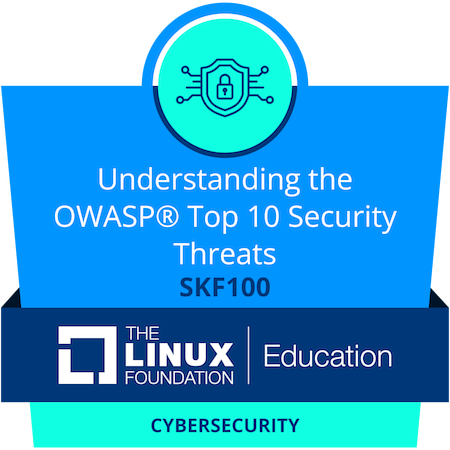

# SFK100_OWASP_Top_10_Security_Threats

  

<h1 align="center">🔐 Laboratórios de Segurança Web - OWASP Top 10</h1>

  
  
  
  

Repositório com estudos práticos, laboratórios e anotações sobre vulnerabilidades do OWASP Top 10.

---

## 📚 Sobre o Projeto

Este repositório contém laboratórios práticos focados nas principais vulnerabilidades do **OWASP Top 10**, com o objetivo de:

- Compreender vulnerabilidades na prática  
- Explorar falhas comuns em aplicações web  
- Aprender técnicas de mitigação  
- Consolidar conhecimento para certificações e mercado  

---

## 🗂 Estrutura do Repositório

### 🔹 Design Seguro
- `06_Desing_Seguro`

### 🔹 Componentes Vulneráveis e Desatualizados
- `08_Componentes_Vulneráveis_e_Desatualizados`

### 🔹 Falhas de Identificação e Autenticação
- `09_Falhas_de_Identificação_Autenticação`

### 🔹 Falhas de Integridade de Software e Dados
- `10_Falhas_de_Integridade_de_Software_e_Dados`

### 🔹 SSRF
- `12_Falsificação_de_Requisição_do_Lado_do_Servidor_(SSRF)`

---

## 🧪 Laboratórios

- `Laboratório_4.1_Aleatoriedade_Insegura_em_Aplicações_Web`
- `Laboratório_4.2_Funções_Hash_Obsoletas`
- `Laboratório_5.1_Injeção_de_SQL`
- `Laboratório_5.2_Injeção_de_Comandos_do_Sistema_Operacional`
- `Lab_5.3_LDAP_Injection`
- `Lab_3.4_Security_Misconfiguration`
- `Laboratório_7.1_Configurações_Inseguras_em_Aplicações_Web`

---

## 🧠 Materiais de Apoio

- `Questoes_para_treinar_no_Anki`
- `infograficos`

---

## 🎯 Objetivo

Este repositório faz parte da minha jornada de aprendizado em:

- Segurança de Aplicações Web  
- Pentest  
- Secure Coding  
- Preparação para certificações  

---

## 🚀 Tecnologias e Conceitos

- SQL Injection  
- Command Injection  
- LDAP Injection  
- SSRF  
- Security Misconfiguration  
- Hashing Seguro  
- Autenticação Segura  

---

## 📌 Referências

- OWASP Top 10  
- OWASP Web Security Testing Guide  
- Secure Coding Practices  

---

## 👨‍💻 Autor

[https://www.linkedin.com/in/edion-geo-cyber/]  

